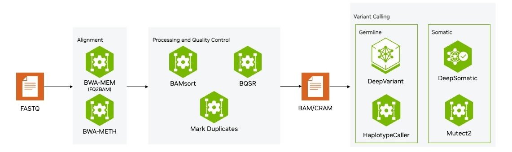

# Germline Analysis Blueprint

Run `download_data.sh` to download the dataset locally. 

In the brev.dev launchable, this data will be pre-downloaded, so users will not have to do this step. 

This repository houses the notebook made to try [Parabricks](https://docs.nvidia.com/clara/parabricks/latest/index.html), a GPU-accelerated software suite for secondary genomic analysis.

The goal of this repository is to help users quickly try the fundamental capabilities of Parabricks on a Whole Exome Data set on their own CUDA capable GPU system, or through the quick deploy capability of Brev.dev Launchables.

# Overview
This repository contains notebooks to help anyone try the Parabricks Germline Workflow.

