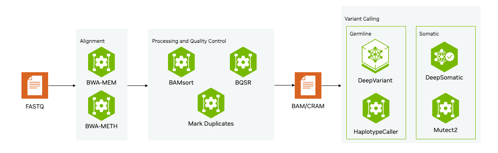

# Parabricks Introduction Notebook 

Run `download_data.sh` to download the dataset locally. 

In the brev.dev launchable, this data will be pre-downloaded, so users will not have to do this step. 

This repository houses the notebook made to try [Parabricks](https://docs.nvidia.com/clara/parabricks/latest/index.html), a GPU-accelerated software suite for secondary genomic analysis.

The goal of this repository is to help users quickly try the fundamental capabilities of Parabricks on a Whole Exome Data set on their own CUDA capable GPU system, or through the quick deploy capability of Brev.dev Launchables.

# Overview
This repository contains notebooks to help anyone try an introductory analysis workflow leveraging Parabricks. We will focus on the germline workflow of fq2bam (Containing BWA-MEM, as well as GATK best practices for data processing and quality control) and Parabricks-accelerated [DeepVariant](https://github.com/google/deepvariant). A 30x whole genome can be run through fq2bam in as little as 6 minutes on an NVIDIA DGX system, compared to 4-9 hours on a CPU instance (m5.24xlarge, 96 x vCPU). In this example, users will run a whole exome in a matter of minutes.

Short-Read Analysis Workflow

# System Requirements
Users may have to wait 5-10 minutes for the instance to start depending on cloud availability. The L40s is recommended for the best combination of cost and performance. Users can also try L4 or T4 (better cost) or A100 (better performance).

The fq2bam tool requires at least 38 GB of GPU memory by default; the --low-memory option will reduce this to 16 GB of GPU memory at the cost of slower processing. All other tools require at least 16 GB of GPU memory per GPU.

This notebook requires an NVIDIA driver with version 525.60.13 or greater. Please check [here](https://docs.nvidia.com/deploy/cuda-compatibility/#forward-compatibility) for more details on forward compatibility. It also requires any Linux Operating System that supports nvidia-docker2 Docker version 20.10 (or higher)

# Notebooks

### **germline_wes**

- This example uses whole exome (WES) data from sample NA12878. 
- In the first step, we will map the sequence reads to the reference genome. The input FASTQ files are aligned using the Burrows-Wheeler Aligner (BWA) through the Parabricks fq2bam tool. 
- Lastly, we will run DeepVariant, a deep learning based variant caller on the aligned reads. - It uses a convolutional neural network to find single nucleotide variants (SNVs) and insertions/deletions (InDels).

After a user is able to run this flow, they can try running this on their own data.

# Terms of use
By using this software or model, you are agreeing to the NVIDIA Parabricks Terms of Use

